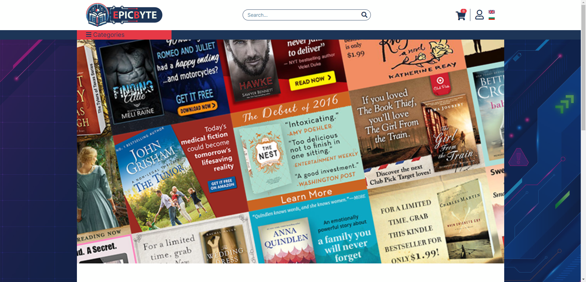

# EpicByte website store (UNDER DEVELOPMENT)

<div align="center">
   <h2>EpicByte</h2>
    <p>Hosted here: <a href="https://epicbyte-XXXX.herokuapp.com/">EpicByte.com</a></p>
</div>

<br />
<details>
  <summary>Table of Contents</summary>
  <ol>
    <li>
      <a href="#getting-started">Getting Started</a>
      <ul>
        <li><a href="#prerequisites">Prerequisites</a>
        <li><a href="#installation">Installation</a></li>
      </ul>
    </li>
    <li>
      <a href="#about-the-project">About The Project</a>
      <ul>
        <li><a href="#built-with">Built With</a></li>
        <li><a href="#front-end">Front End</a></li>
        <li><a href="#back-end">Back End</a></li>
      </ul>
    </li>
    <li><a href="#usage">Usage</a>
      <ul>
        <li><a href="#admin">Admin</a></li>
      </ul>
      <ul>
        <li><a href="#user">User</a></li>
      </ul>
    </li>
    <li><a href="#rest-test">REST Test</a></li>
  </ol>
</details>


## Getting Started

### Prerequisites

* JDK 17
* IDE (Eclipse / IntelliJ IDEA)
* Depending on the features you want to use, you may need some third-party software, such as [MySQL Workbench](https://dev.mysql.com/downloads/workbench/) for data modeling, SQL development, and comprehensive administration for the system data.

### Installation
In order to run CarWash you need to:

1. <a href="https://github.com/PePetrov96/EpicByte/archive/refs/heads/master.zip">DOWNLOAD</a> the repo.
2. Set up environment variables `${MYYSQL_PORT}, ${MYSQL_USER}.. etc...`
   ```yaml
   spring.datasource.url: jdbc:mysql://localhost:${MYSQL_PORT}/EpicByte_database?allowPublicKeyRetrieval=true&useSSL=false&createDatabaseIfNotExist=true&serverTimezone=UTC
   spring.datasource.username: ${MYSQL_USER}
   spring.datasource.password: ${MYSQL_PASSWORD}
   
   admin.username: ${ADMIN_USERNAME}
   admin.password: ${ADMIN_PASSWORD}
   
   server.port: ${PORT:5000}
   
   name: ${CLOUDINARY_NAME}
   api-key: ${CLOUDINARY_API_KEY}
   api-secret: ${CLOUDINARY_API_SECRET}
   ```
3. Start the application and enjoy!


## About The Project


_EpicByte project is a Spring Boot-based application designed to create a website for selling books, movies, music and more. It offers users the convenience of registering, viewing products, selecting products to add to their carts, changing their profile details and more. It offers administrators, the ability to create and add new products, reviewing all open orders from users and more._

### Built With

* 
* 
* 
* 
* 
* 
* 
* 
* 
* 

### Front End

_Thymeleaf View Engine utilized in this project for rendering dynamic HTML content by binding data from the backend to the frontend through templates._

- [x] **Exception handling**
- [x] **Custom pages**
- [x] **Data validation**
- [x] **Custom messages for invalid data**

### Back End

_The project incorporates some Aspect-Oriented Programming (AOP) to modularize cross-cutting concerns._

* **Scheduled Task** :

1. **`Removing "New" status from products`**: Products who have a status of newly added, appear with a special classification. Any product added in the store more than 7 days ago, receives normal status.

---

* **Internalization/i18n** :

1. **`Bulgarian`**
2. **`English`**

---
* **Mapping**

1. **`ModelMapper`** - In this project, [ModelMapper](https://modelmapper.org/) was employed to handle the mapping between different types of objects, mainly between entity models and DTOs.

---

* **Authentication**

1. Handled through Spring security with a web cookie.
- [x] *Expiration*: The token expires after 24 hours.
---

* **Exception Handling**
1. **`Custom exception`** handling is implemented within the application to manage and respond to exceptional situations or errors that occur during the runtime of the system.
2. **`Custom validators`** handling is implemented to manage the response of invalid data being entered into fields, for adding products, registering, logging-in and more.
---

* **Integrated services**

1. **`Cloudinary`** for managing and storing external image files for the products.
---

* **Testing**
**`TBC`**

---

## Usage

### User Rights
*The below list should not be considered fully complete, on the account of what each user can do.*

#### Admin
* The **`Admin`**, is saved in the memory and is not present in the database. The Admin username and password need to be set, from the project properties. Special Admin rights include:
  * Add new products (Books, Textbooks, Music, Movies, Toys)
  * Delete products
  * Update products
  * Review all user orders and change their status
  * Review individual user orders in detail
  * Give and Revoke **`Moderator`** rights from any user.
* The **`Admin`**, due to not being an actual database entity, cannot perform the following actions:
  * Open the Profile menu
  * Open the User orders menu
  * Add a product to their cart
  * Create a new order, with all the cart items

#### Moderator
* The **`Moderator`** role is a user entity, saved in the database, with standard user information and Moderator rights (provided by the **`Admin`**). The Moderator can do anything the Admin can, except for giving and revoking **`Moderator`** rights to **`User`**. Unlike the **`Admin`** entity, the **`Moderator`** entity, can perform all the actions the **`Admin`** entity cannot.

#### User
* The **`User`** role is a user entity, saved in the database, with standard user information and User rights. The User can do the following:
  * Open their profile, to change their information:
    * First name
    * Last name
    * Username
    * Email
  * Review all products
  * Order how the products are displayed, in "New", "Alphabetical", "Highest price" or "Lowest price" orders
  * Review product details
  * Place a new order, by entering address details and confirming the final price
  * Add any product to their cart (in any quantity they desire)
  * Open "Orders" menu, to review all their current and past orders.
  * Logout

#### Anonymous
* The **`Anonymous`** entity, is a not-logged-in or even not registered site visitor. They can perform the following actions:
  * Register
  * Login
  * Review all products
  * Order how the products are displayed, in "New", "Alphabetical", "Highest price" or "Lowest price" orders
  * Review product details

## REST Test
**`TBC`**

